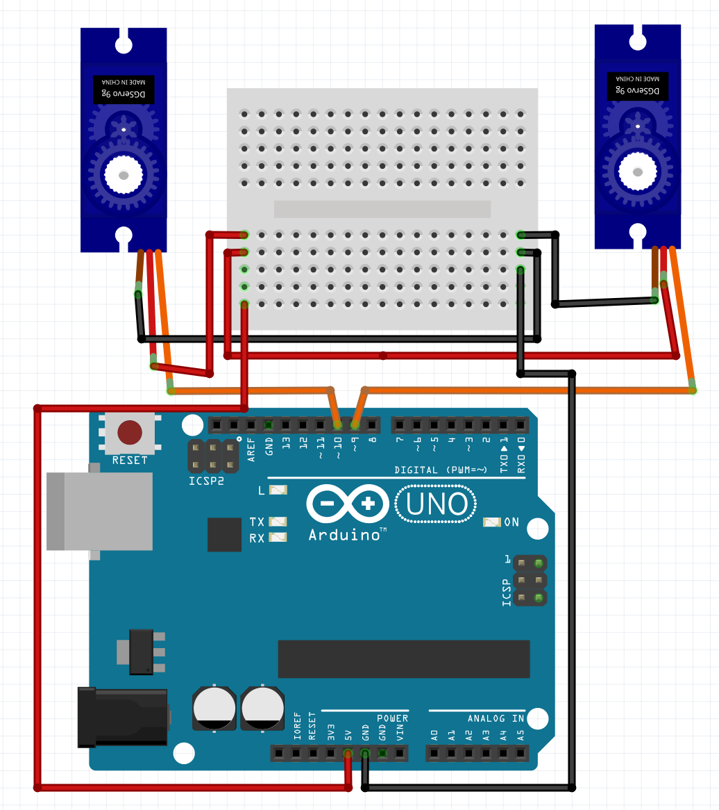
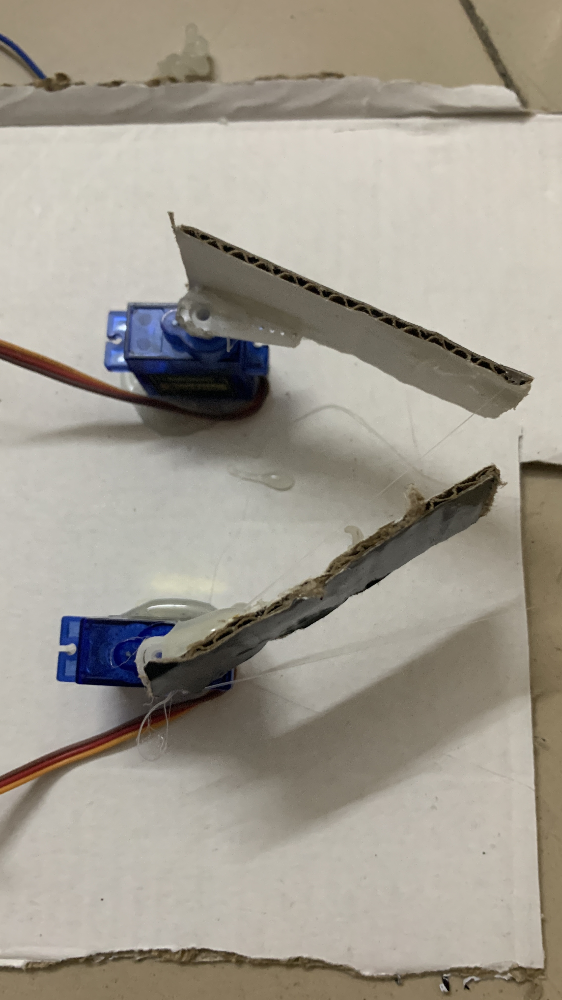

# প্রজেক্ট ২ — রোবটিক আর্ম (গ্র্যাবার)

মূল বইয়ের প্রজেক্ট ১৩। বইয়ের পাতা প্রায় ১৪১–১৪৪।

## কী করব

দুইটা সারভো দিয়ে হাত বানাব। হাত খুললে বস্তু ছাড়ে, কাছাকাছি এলে ধরে।

## ধারণা A থেকে Z

দুই দিকে মুখ করে থাকলে বস্তু ধরা যায় না। আগে ধরা থাকলে এখন ছেড়ে দেবে।

বস্তু ধরতে চাইলে হাত দুটোকে নিজেদের কাছাকাছি আনতে হবে। দুইটারই কোণ সমান পরিমাণে বদলাব।

উদাহরণ: একটা সারভো 0 ডিগ্রি, অন্যটা 100 ডিগ্রি — হাত খোলা।

গড় = (100 + 0) / 2 = 50।

তাই 0 ডিগ্রির সারভোকে 50 ডিগ্রি বাড়িয়ে 50-এ আনব। 100 ডিগ্রির সারভোকে 50 ডিগ্রি কমিয়ে 50-এ আনব। দুটোই কাছাকাছি আসবে, অবজেক্ট গ্র্যাব হবে।

কোণ নিজের হাত দেখে বদলাতে হবে। সব সারভো 0 ডিগ্রিতে একদিকে ঘোরে না। আগে হর্ন লাগিয়ে খোলা-বন্ধ চোখে দেখে নাও।

## যা লাগবে

- Arduino Uno
- 2টা SG90
- ব্রেডবোর্ড
- জাম্পার
- কার্ডবোর্ডের ফালি
- হট গ্লু

## সার্কিট

চিত্র ৮৫: প্রজেক্ট ১৩-এর সার্কিট ডায়াগ্রাম।



বামপাশের সারভো:

| Arduino | সারভো |
|---|---|
| 5V | VCC |
| GND | GND |
| ডিজিটাল 10 | কন্ট্রোল |

ডানপাশের সারভো:

| Arduino | সারভো |
|---|---|
| 5V | VCC |
| GND | GND |
| ডিজিটাল 9 | কন্ট্রোল |

দুই সারভোর লাল একসাথে 5V, কালো একসাথে GND। সিগন্যাল আলাদা PWM পিনে। অন্য পিন ব্যবহার করলেও সেটা PWM হতে হবে, নাহলে সারভো কাজ করবে না।

## বানানো ছবি

চিত্র ৮৬-এর মতো রোবটিক আর্ম।



কার্ডবোর্ডের ফালি হট গ্লু দিয়ে হর্নে লাগানো। হাত খোলা অবস্থায় দূরে, বন্ধ করলে কাছাকাছি।

বই বলে: এটা দিয়ে বেশি ভারী বস্তু ঠিকমতো তোলা যায় না। ভারী টর্কের সারভো লাগে। বাজারে সরাসরি রোবটিক আর্ম পাওয়া যায়। চিত্র ৮৭-এর মতো 2 DOF আর্ম কিনলেও সারভোর পজিশন বদলে অবজেক্ট গ্র্যাব করা যায়।

## কোড

ফাইল: `codes/project2_robotic_arm.ino`

```cpp
#include <Servo.h>
Servo servo1;
Servo servo2;

void setup() {
  servo1.attach(10);
  servo2.attach(9);
}

void loop() {
  servo1.write(0);
  servo2.write(100);
  delay(2000);
  servo1.write(50);
  servo2.write(50);
  delay(2000);
}
```

## কোড ব্যাখ্যা

- `servo1` বাম, পিন 10। `servo2` ডান, পিন 9।
- প্রথম দুই লাইন হাত খোলে: 0 আর 100। 2 সেকেন্ড থাকে।
- পরের দুই লাইন দুটোকেই 50-এ আনে। হাত বন্ধ। আবার 2 সেকেন্ড।
- লুপ তাই খোলা-বন্ধ করতেই থাকে।

নিজে কিউব বা ছোট অবজেক্ট তুলে দেখো। না ধরলে 0/100 আর 50 বদলে নাও, যেমন 20 আর 80, তারপর 50।


---
