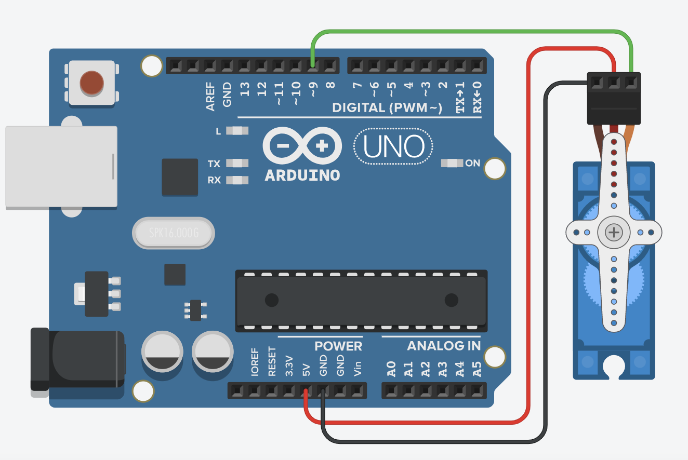

# প্রজেক্ট ৩ — সিরিয়াল মনিটর দিয়ে সারভো

মূল বইয়ের প্রজেক্ট ১৪। বইয়ের পাতা প্রায় ১৪৫–১৪৭।

## কী করব

কম্পিউটার থেকে কোণ লিখে সারভোকে সেই ডিগ্রিতে পাঠাব। সুইপের মতো নিজে নিজে ঘুরবে না। তুমি যে সংখ্যা দেবে, সেখানে গিয়ে থামবে।

## যা লাগবে

- সারভো মোটর
- জাম্পার তার
- Arduino Uno
- USB কেবল (সিরিয়ালের জন্য)

## সার্কিট

চিত্র ৮৮: প্রজেক্ট ১৪-এর সার্কিট ডায়াগ্রাম। প্রজেক্ট ১-এর মতোই।



| Arduino | সারভো |
|---|---|
| 5V | VCC (লাল) |
| GND | GND (কালো) |
| ডিজিটাল 9 | কন্ট্রোল |

ডায়াগ্রামে সবুজ পিন 9, লাল 5V, কালো GND।

## যেভাবে করব

1. সার্কিট লাগাও।
2. কোড আপলোড করো।
3. Tools → Serial Monitor খোলো। বোড রেট 9600।
4. 10 থেকে 170-এর মধ্যে একটা সংখ্যা লিখে Enter দাও।
5. সারভো সেই কোণে ঘুরবে।

আগে ক্যালিব্রেশন করো: 0 লিখে Enter, তারপর 180, তারপর 90। হর্ন সোজা না থাকলে 90-এ হর্ন খুলে আবার লাগাও।

বই বলে: সারভোকে 50 ডিগ্রি কোণে ঘুরতে বললে সে সেই পজিশনে যায়। 10–170-এর বাইরে খুব কিনারায় না পাঠানোই ভালো, কিছু সারভো কিনারায় আটকে গিঁট বাজায়।

## কোড

ফাইল: `codes/project3_serial_servo.ino`

```cpp
#include <Servo.h>
Servo myservo;

void setup() {
  Serial.begin(9600);
  myservo.attach(9);
  Serial.println("Angle likho (0-180):");
}

void loop() {
  if (Serial.available() > 0) {
    int angle = Serial.parseInt();
    if (angle >= 0 && angle <= 180) {
      myservo.write(angle);
      Serial.print("Gelo: ");
      Serial.println(angle);
    }
  }
}
```

## কোড A থেকে Z

- `Serial.begin(9600)` — কম্পিউটারের সঙ্গে কথা বলার গতি। মনিটরের বোড রেটও 9600 হতে হবে।
- `myservo.attach(9)` — সিগন্যাল পিন 9।
- `Serial.available()` — মনিটরে কিছু লেখা হয়েছে কি না।
- `Serial.parseInt()` — লেখা থেকে সংখ্যা বের করে।
- 0 থেকে 180-এর বাইরে হলে উপেক্ষা। ভেতরে হলে `write`।
- মনিটরে “Gelo: 90” দেখায়, যাতে বোঝা যায় কমান্ড গেছে।

সংখ্যা না পড়লে মনিটরের লাইন এন্ডিং Newline করে আবার Enter দাও।
