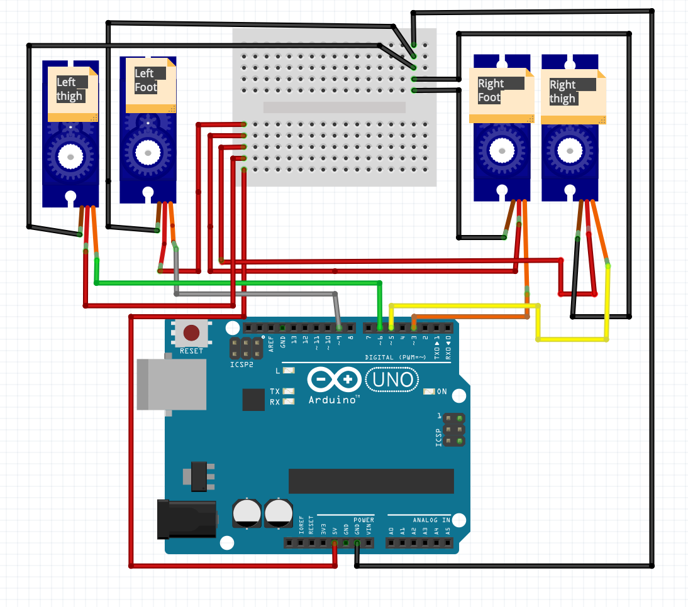
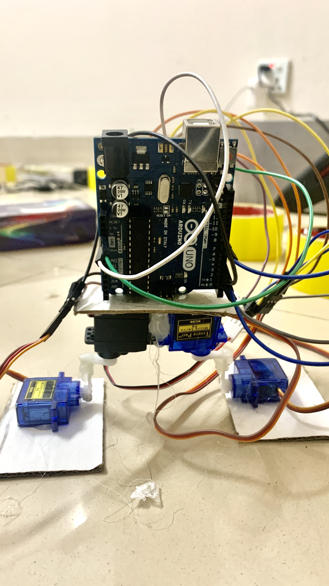
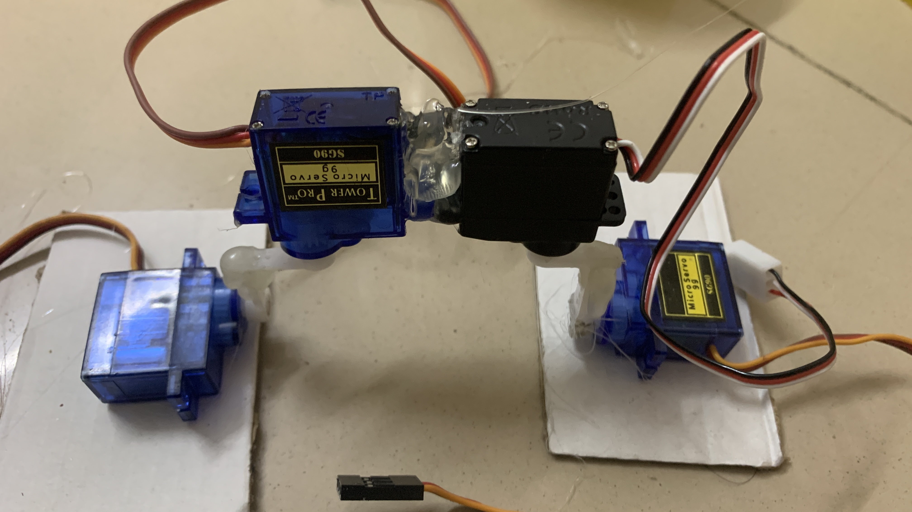
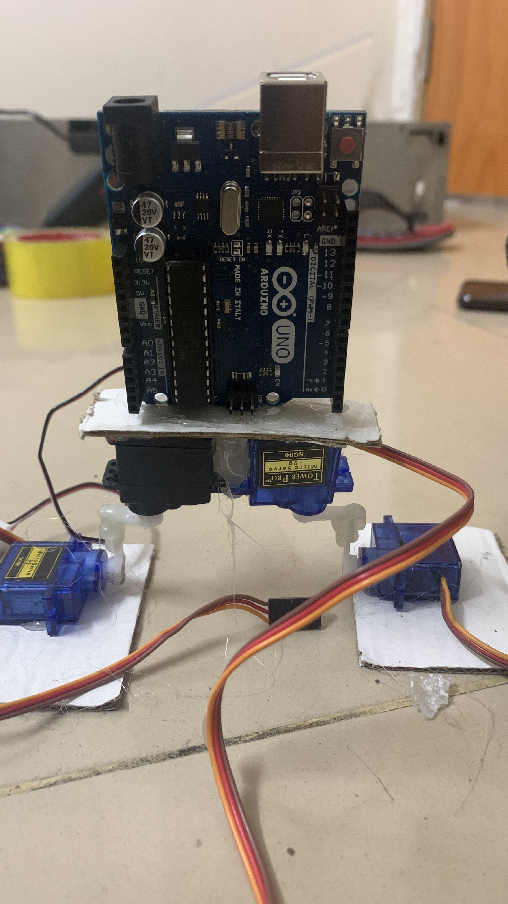

# প্রজেক্ট ৪ — বাইপেডাল রোবট (দুই পা)

মূল বইয়ের প্রজেক্ট ১৫। চিত্র ৮৯-এর কাজ।

## কী করব

চারটা সারভো দিয়ে দুই পা। কোণ পাল্টালে দুই পায়ে ভর দিয়ে হাঁটার মতো নড়াচড়া।

## ধারণা A থেকে Z

সারভোকে নির্দিষ্ট পজিশনে নেওয়া যায়। এই ক্ষমতা কাজে লাগাব। 4টি মোটর এমনভাবে যুক্ত করব যেন বিভিন্ন কোণে পজিশন পাল্টে দুই পায়ে ভর দিয়ে হাঁটে।

1. মোটরগুলোকে জোড়ায় জোড়ায় যুক্ত করো। দুটি মোটর একসঙ্গে, পাখা 90 ডিগ্রি কোণে মুখোমুখি জোড়া। চিত্র ৮৯-এর মতো।
2. এভাবে দুই জোড়া তৈরি। এগুলোই দুই পা।
3. প্রতি পায়ে দুটি মোটর। একটি উরু। আরেকটি পায়ের নিচের অংশ বা পায়ের পাতা।

আগে সব সারভো 90 ডিগ্রিতে রেখে হর্ন লাগাও। নাহলে হাঁটার সময় পা উল্টো দিকে যায়।

চার সারভো একসাথে Uno-র 5V টানলে বোর্ড রিসেট হতে পারে। সারভোর VCC আলাদা 5V থেকে দাও, GND কমন রাখো।

## যা লাগবে

- Arduino Uno
- 4টা SG90
- ব্রেডবোর্ড
- জাম্পার
- কার্ডবোর্ড
- হট গ্লু

## সার্কিট



ডায়াগ্রামের লেবেল:

| অংশ | তারের রং | পিন |
|---|---|---|
| Left thigh | সবুজ | 9 |
| Left foot | ধূসর | 10 |
| Right foot | কমলা | 5 |
| Right thigh | হলুদ | 3 |

সব সারভোর লাল 5V। সব কালো GND, ব্রেডবোর্ডের রেল দিয়ে। পিন সব PWM: 3, 5, 9, 10।

## বানানো ছবি

Arduino উপরে, দুই পা নিচে:



জোড়া সারভো, হট গ্লু, সাদা কার্ডবোর্ডের পা:





কালো আর নীল SG90। Tower Pro Micro Servo 9g।

## কোড

ফাইল: `codes/project4_biped.ino`

```cpp
#include <Servo.h>
Servo leftThigh, leftFoot, rightThigh, rightFoot;

void setup() {
  leftThigh.attach(9);
  leftFoot.attach(10);
  rightFoot.attach(5);
  rightThigh.attach(3);
}

void loop() {
  leftThigh.write(90);
  leftFoot.write(90);
  rightThigh.write(90);
  rightFoot.write(90);
  delay(800);

  leftThigh.write(70);
  rightThigh.write(110);
  delay(400);
  leftFoot.write(60);
  rightFoot.write(120);
  delay(500);

  leftThigh.write(110);
  rightThigh.write(70);
  delay(400);
  leftFoot.write(120);
  rightFoot.write(60);
  delay(500);
}
```

## কোড ব্যাখ্যা

- প্রথমে চার সারভো 90-এ। এটা দাঁড়ানো।
- তারপর বাম উরু 70, ডান উরু 110। শরীর একদিকে কাত।
- পাতা 60 আর 120। এক পা ওঠে, অন্য পা ভর নেয়।
- পরের ধাপে উল্টো। তাই দুই পা পাল্টে পাল্টে নড়ে।

কোণ ফ্রেম দেখে টিউন করো। এক পাশে 70 হলে অন্য পাশে 110 রাখলে ভারসাম্য থাকে। দেরি বাড়িয়ে ধীর হাঁটা দেখো।


---

## ছবির আগের লেখা (বই)

প্রজেক্ট ১৫: দুই পা-বিশিষ্ট বেসিক হিউমানয়েড রোবট বানাই।

যা করতে যাচ্ছি: খুবই বেসিক হিউমানয়েড। মানুষের মতো দুই পায়ে ভর দিয়ে হাঁটাহাঁটি। আইডিয়া প্রথম পাওয়া Instructables-এ। একজন রোবটপ্রেমী নিজে বানিয়ে টিউটোরিয়াল শেয়ার করেছিলেন। লিংক: https://www.instructables.com/Make-A-Simple-Bidepal-Humanoid-Robot/ মূল ডেভেলপারকে কমেন্টে ধন্যবাদ জানানো যায়।

কেন বানাচ্ছি: হিউমানয়েডের চলাচল আর নড়াচড়া আগের চেয়ে পরিষ্কার হবে।

যেভাবে করব: সারভো নির্দিষ্ট পজিশনে নেওয়া যায়। এই সুবিধা কাজে লাগাব। 4টি মোটর এমনভাবে যুক্ত যেন কোণ পাল্টে দুই পায়ে ভর দিয়ে হাঁটার মতো নড়ে।

ছবির আগে, ধাপ ১: মোটর জোড়ায় জোড়ায়। দুটি মোটর একসঙ্গে, পাখা 90 ডিগ্রি মুখোমুখি। চিত্র ৮৯-এর মতো জোড়া।

## ছবির পরের লেখা (বই)

চিত্র ৮৯-এর পরে: এভাবে দুই জোড়া। এগুলোই দুই পা। প্রতি পায়ে একটি মোটর উরু, আরেকটি পায়ের নিচের অংশ বা পাতা।

চিত্র ৯০ সার্কিটের পরে তার মিলিয়ে নাও: Left thigh, Left foot, Right foot, Right thigh। পাওয়ার আর গ্রাউন্ড কমন।

চিত্র ৯২-এর আগে: কার্ডবোর্ডের টুকরা দুই পায়ের উরুর মোটরের ওপরে আঠা দিয়ে জোড়া।

জোড়া লাগানোর পর Arduino উপরে বসবে, পা নিচে থাকবে। 90 ডিগ্রিতে হর্ন না লাগালে হাঁটার সময় পা উল্টো যায়।
