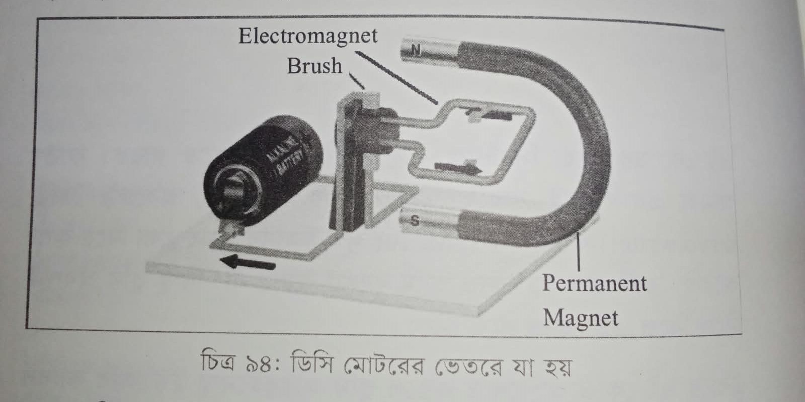

# প্রজেক্ট ৫ — ডিসি মোটর

মূল বইয়ের প্রজেক্ট ১৬। এখানে Arduino নেই। আগে বুঝতে হবে মোটর ঘোরে কীভাবে, তারপর ব্যাটারি লাগিয়ে নিজে দেখব।

বাসার লাইনের কারেন্ট বারবার দিক বদলায়। এটাকে বলে AC। ব্যাটারি থেকে যে তড়িৎ আসে, তার দিক বদলায় না। এটাকে বলে DC। ডিসি মোটর এই দ্বিতীয় ধরনের তড়িতে চলে।

মোটরের ভেতরে একটা তড়িচ্ছুম্বক থাকে, আর বাইরে স্থায়ী চুম্বক। তড়িৎ গেলে তড়িচ্ছুম্বক তৈরি হয়। সেটা স্থায়ী চুম্বকের দিকে টানে, আর শ্যাফট ঘুরতে থাকে। তড়িৎ যত বেশি, টান তত জোর, ঘোরা তত জোর। তড়িৎ কমলে গতি কমে। ব্রাশ কারেন্টকে ঘুরন্ত কয়েলে পৌঁছে দেয়।

চিত্র ৯৪-এ ভেতরের ছবি। বাঁয়ে ব্যাটারি, মাঝে ব্রাশ, ডানে N আর S মার্ক করা স্থায়ী চুম্বক।

ঘোরার দিক নির্ভর করে প্লাস-মাইনাস কোন তারে লাগানো। তার উল্টালে মোটর উল্টো দিকে ঘোরে। RPM আলাদা হয় কারণ পাওয়ার আলাদা। যত বেশি সরবরাহ, তত বেশি স্পিড।

এবার হাতে দেখি। ৯ ভোল্ট ব্যাটারির লাল তার মোটরের এক প্রান্তে, কালো অন্য প্রান্তে। মোটর ঘুরবে। দুই তার পাল্টে লাগালে উল্টো দিকে ঘুরবে।

৩ ভোল্ট, ৬ ভোল্ট আর ৯ ভোল্ট দিয়ে গতি তুলনা করা যায়। ছোট গিয়ার মোটরের রেট সাধারণত ৩ থেকে ৬ ভোল্ট। ৯ ভোল্ট বেশিক্ষণ দিলে গরম হতে পারে।

এই প্রজেক্টে বোর্ড লাগেনি, কারণ আমরা শুধু ঘোরা আর দিক দেখছি। পরের প্রজেক্টে Arduino দিয়ে দিক আর গতি বদলাতে H-bridge লাগবে। বোর্ড নিজে থেকে মোটরের তার উল্টাতে পারে না।
