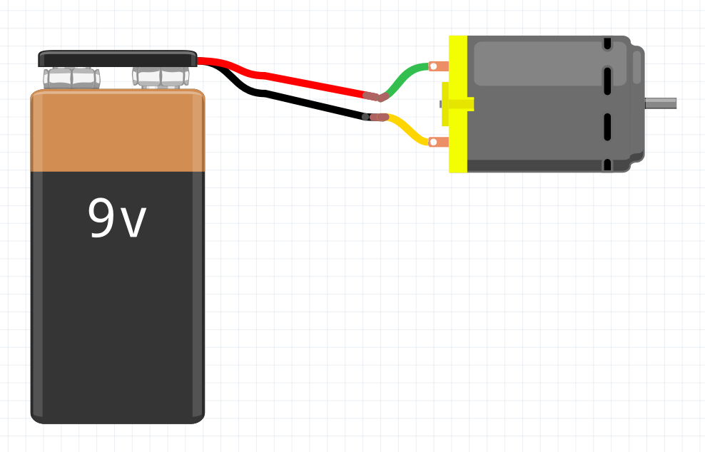

# প্রজেক্ট ৫ — ডিসি মোটর সরাসরি ব্যাটারিতে

মূল বইয়ের প্রজেক্ট ১৬।

## ধারণা

ডিসি মোটরে কারেন্ট দিলে ভেতরের কয়েল চুম্বকের সঙ্গে ধাক্কা খেয়ে ঘোরে। ভোল্টেজ বাড়লে RPM বাড়ে। দিক বদলাতে তার উল্টে লাগাতে হয়।

এই প্রজেক্টে Arduino নেই। শুধু ব্যাটারি দিয়ে মোটর ঘোরানো।

## সার্কিট

9V ব্যাটারির লাল (+) মোটরের এক প্রান্তে, কালো (−) অন্য প্রান্তে। তার উল্টালে মোটর উল্টো দিকে ঘোরে।

## যা দেখব

- 3V, 6V, 9V দিয়ে গতি আলাদা
- বেশি ভোল্টেজে বেশি ঘোরা
- তার উল্টালে দিক বদল

মোটরের রেটেড ভোল্টেজের বেশি দিও না। ছোট গিয়ার মোটর সাধারণত 3–6V। 9V একটু বেশি হতে পারে, অল্প সময়ের জন্য পরীক্ষা করো।

পরের প্রজেক্টে এই দিক আর গতি Arduino দিয়ে নিয়ন্ত্রণ হবে।
