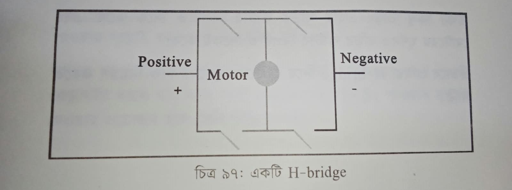
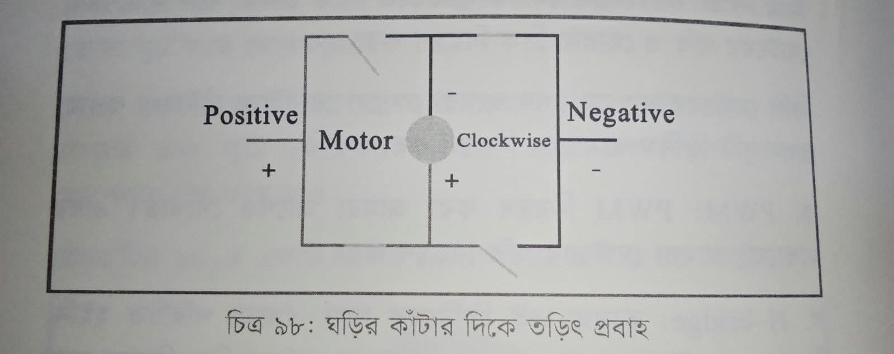
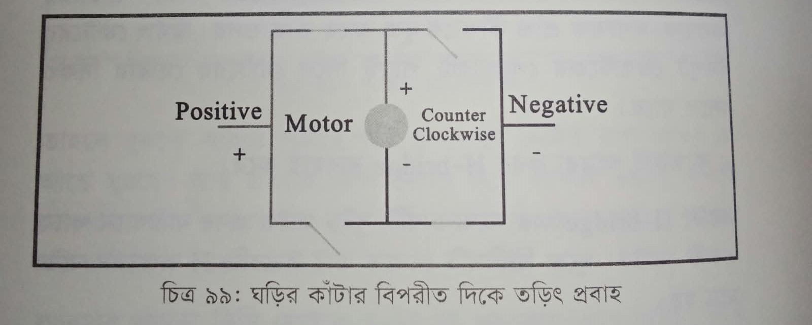
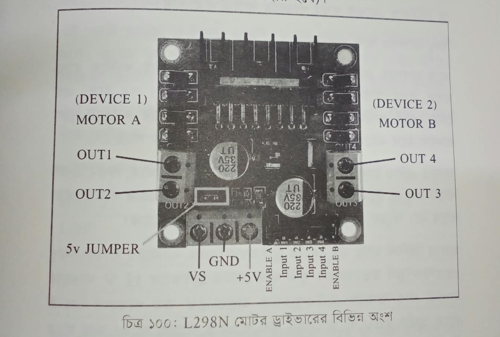
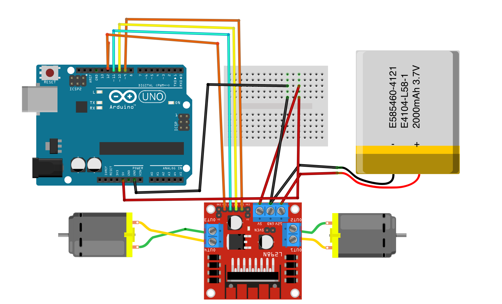

# প্রজেক্ট ৬ — L298N দিয়ে দুই মোটর

মূল বইয়ের প্রজেক্ট ১৭।

রোবটকে সামনে-পেছনে চালাতে দুটো জিনিস লাগে। একটা গতি, সেটা PWM। আরেকটা দিক, সেটা H-bridge।

আগের প্রজেক্টে দেখেছি, তার উল্টালে মোটর উল্টো ঘোরে। হাতে তার উল্টানো যায়। বোর্ড থেকে সেই উল্টানোর কাজ করে H-bridge।

একটা H-bridge-এ চারটা সুইচ, মাঝখানে মোটর। দেখতে ইংরেজি H। বাঁয়ে পজিটিভ, ডানে নেগেটিভ।



ওপরের ডান সুইচ আর নিচের বাম সুইচ বন্ধ করলে তড়িৎ ঘড়ির কাঁটার দিকে যায়। মোটরও সেই দিকে ঘোরে।



অন্য জোড়া সুইচ বন্ধ করলে তড়িৎ উল্টো দিকে, মোটরও উল্টো।



L298N এই ব্রিজকে ছোট বোর্ডে এনেছে। দুই চ্যানেল, তাই দুই মোটর। বাঁ দিক মোটর A, ডান দিক মোটর B।



OUT1 আর OUT2 প্রথম মোটরের দুই তার। OUT3 আর OUT4 দ্বিতীয় মোটরের। নিচে VS মোটরের পাওয়ার, GND গ্রাউন্ড, +5V লজিক। ENABLE A আর ENABLE B গতির পিন। Input 1 থেকে Input 4 দিকের পিন। 5V জাম্পার লাগানো থাকলে এনাবল সবসময় চালু, গতি কমানো যায় না। গতি চাইলে জাম্পার খুলে এনাবল Arduino-র PWM-এ দিতে হয়।

দিকের লজিক সোজা। দুই ইনপুট LOW হলে মোটর থেমে। প্রথম HIGH দ্বিতীয় LOW হলে সামনে। প্রথম LOW দ্বিতীয় HIGH হলে পেছনে। দুটোই HIGH হলে ব্রেক।

| ইনপুট ১ | ইনপুট ২ | কী হয় |
|---|---|---|
| LOW | LOW | থেমে |
| HIGH | LOW | সামনে |
| LOW | HIGH | পেছনে |
| HIGH | HIGH | ব্রেক |

যা লাগবে: L298N, Arduino Uno, জাম্পার, দুই গিয়ার মোটর, ব্যাটারি বা ১২ ভোল্ট অ্যাডাপ্টার, স্ক্রু ড্রাইভার। ডায়াগ্রামে ৩.৭ ভোল্ট ২০০০ mAh ব্যাটারি, লেবেল E585460-4121। মোটরের রেট দেখে সাপ্লাই দাও। Uno-র ৫ ভোল্ট দিয়ে মোটর চালাবে না।

সার্কিটে কমলা-হলুদ সিগন্যাল Arduino থেকে ড্রাইভারে। লাল-কালো ব্যাটারি থেকে ড্রাইভারের পাওয়ারে। সেই কালো GND Arduino-র GND-এর সঙ্গে মেলাতে হবে, নাহলে ড্রাইভার সিগন্যাল বোঝে না।



| L298N | কোথায় |
|---|---|
| IN1 | ডিজিটাল ৮ |
| IN2 | ডিজিটাল ৭ |
| IN3 | ডিজিটাল ৫ |
| IN4 | ডিজিটাল ৪ |
| ENA | ডিজিটাল ৯ |
| ENB | ডিজিটাল ৩ |
| OUT1, OUT2 | মোটর A |
| OUT3, OUT4 | মোটর B |
| VS | ব্যাটারির প্লাস |
| GND | ব্যাটারির মাইনাস, আর Arduino GND |

কোড বড় দেখে ভয়ের কিছু নেই। আগে ভ্যারিয়েবলে বলে দেওয়া কোন পিন কার। তারপর সব পিন OUTPUT। শুরুতে সব ইনপুট LOW, যাতে আপলোডের সময় মোটর ছুটে না যায়।

`codes/project6_L298N.ino`

```cpp
int enA = 9, in1 = 8, in2 = 7;
int enB = 3, in3 = 5, in4 = 4;

void setup() {
  pinMode(enA, OUTPUT);
  pinMode(enB, OUTPUT);
  pinMode(in1, OUTPUT);
  pinMode(in2, OUTPUT);
  pinMode(in3, OUTPUT);
  pinMode(in4, OUTPUT);
  digitalWrite(in1, LOW);
  digitalWrite(in2, LOW);
  digitalWrite(in3, LOW);
  digitalWrite(in4, LOW);
}

void loop() {
  analogWrite(enA, 200);
  analogWrite(enB, 200);
  digitalWrite(in1, HIGH);
  digitalWrite(in2, LOW);
  digitalWrite(in3, HIGH);
  digitalWrite(in4, LOW);
  delay(2000);
  digitalWrite(in1, LOW);
  digitalWrite(in2, HIGH);
  digitalWrite(in3, LOW);
  digitalWrite(in4, HIGH);
  delay(2000);
  digitalWrite(in1, LOW);
  digitalWrite(in2, LOW);
  digitalWrite(in3, LOW);
  digitalWrite(in4, LOW);
  delay(1000);
}
```

`analogWrite` ২০০ মানে প্রায় পুরো গতি, একটু কম। ২৫৫ পুরো গতি। প্রথম দুই সেকেন্ড দুই মোটর সামনে। তার উল্টো করলে পেছনে। সব LOW করলে থেমে। এক মোটর উল্টো ঘুরলে তার OUT-এর দুই তার পাল্টে দাও।

গতি ধীরে বাড়াতে চাইলে এনাবলে ০ থেকে ২৫৫ পর্যন্ত লুপ চালানো যায়।

```cpp
for (int i = 0; i < 256; i++) {
  analogWrite(enA, i);
  analogWrite(enB, i);
  delay(20);
}
```
