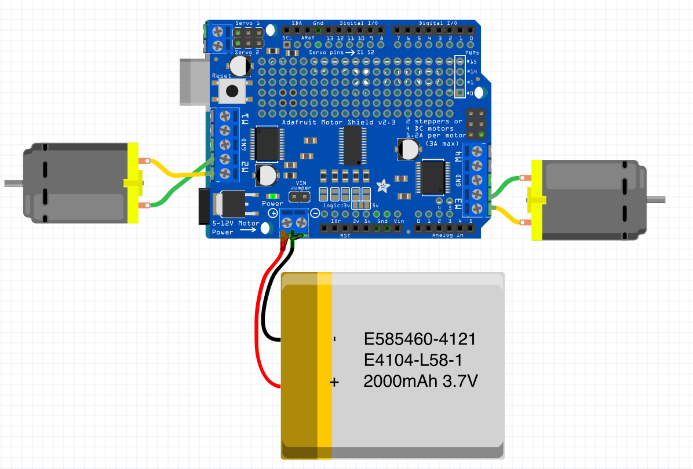

# প্রজেক্ট ৭ — Adafruit Motor Shield দিয়ে দুই মোটর

মূল বইয়ের প্রজেক্ট ১৮।

## কী করব

L298N-এ অনেক জাম্পার। Motor Shield Arduino-র উপরে বসে, IN পিন আলাদা করে লাগাতে হয় না। মোটর স্ক্রু টার্মিনালে যায়। পাওয়ার আলাদা ব্যাটারি থেকে।

## ডায়াগ্রামে যা আছে

Adafruit Motor Shield v2.3।

লেখা: 2 steppers অথবা 4 DC motors। প্রতি মোটরে 1.2A। মোট 3A।

Servo পিনও আছে শিল্ডের উপরে (Servo 1, Servo 2), এই প্রজেক্টে সেগুলো ব্যবহার হচ্ছে না। এই প্রজেক্টে দুই ডিসি মোটর।

## সার্কিট



1. শিল্ড Arduino Uno-র উপরে বসাও। পিন যেন বেঁকে না যায়।
2. বাম মোটর M2 টার্মিনালে। ডায়াগ্রামে হলুদ-সবুজ তার।
3. ডান মোটর M1 টার্মিনালে।
4. নিচের পাওয়ার টার্মিনালে ব্যাটারি।
   - লাল = প্লাস
   - কালো = মাইনাস
5. ব্যাটারি লেবেল: E585460-4121, E4104-L58-1, 2000mAh 3.7V।
6. শিল্ডে লেখা 5–12V Motor Power।

3.7V একটা সেলে অনেক গিয়ার মোটর ধীরে ঘোরে বা ঘোরে না। না ঘুরলে 6V প্যাক দাও। 12V-এর বেশি দিও না।

## লাইব্রেরি

Arduino IDE → Library Manager → Adafruit Motor Shield V2।

ডায়াগ্রামে v2.3, তাই v2 লাইব্রেরি। পুরনো v1 শিল্ড হলে AFMotor লাইব্রেরি, কোড আলাদা।

## কোড

ফাইল: `codes/project7_motor_shield.ino`

```cpp
#include <Adafruit_MotorShield.h>

Adafruit_MotorShield AFMS = Adafruit_MotorShield();
Adafruit_DCMotor *motor1 = AFMS.getMotor(1);
Adafruit_DCMotor *motor2 = AFMS.getMotor(2);

void setup() {
  AFMS.begin();
  motor1->setSpeed(200);
  motor2->setSpeed(200);
}

void loop() {
  motor1->run(FORWARD);
  motor2->run(FORWARD);
  delay(2000);

  motor1->run(BACKWARD);
  motor2->run(BACKWARD);
  delay(2000);

  motor1->run(RELEASE);
  motor2->run(RELEASE);
  delay(1000);
}
```

## কোড A থেকে Z

- `Adafruit_MotorShield AFMS` — শিল্ডের অবজেক্ট।
- `getMotor(1)` মানে M1। `getMotor(2)` মানে M2।
- `AFMS.begin()` — শিল্ড চালু। না দিলে মোটর নড়ে না।
- `setSpeed(200)` — 0 থেকে 255। 200 মানে প্রায় পুরো গতি, একটু কম।
- `run(FORWARD)` — সামনে। `run(BACKWARD)` — পেছনে। `run(RELEASE)` — থেমে, ব্রেক নয়, ছেড়ে দেওয়া।
- 2 সেকেন্ড সামনে, 2 সেকেন্ড পেছনে, 1 সেকেন্ড থেমে।

M1 আর M2 উল্টো লাগলে FORWARD আর BACKWARD বদলাও, অথবা টার্মিনালের তার উল্টো দাও।

এক মোটর না ঘুরলে টার্মিনালের স্ক্রু আবার টাইট করো। পাওয়ার টার্মিনালে ব্যাটারি আছে কি না দেখো। USB দিলে লজিক চলে, মোটরের পাওয়ার আলাদা লাগে।


---

## ছবির আগের লেখা (বই)

L298N-এ অনেক তার। Motor Shield বোর্ডের উপরে বসে, আলাদা IN জাম্পার কমে। ডায়াগ্রামে Adafruit Motor Shield v2.3। লেখা: 2 steppers অথবা 4 DC motors, প্রতি মোটরে 1.2A, মোট 3A। পাওয়ার 5–12V।

ছবির আগে: শিল্ড Uno-র উপরে। বাম মোটর M2, ডান মোটর M1। নিচে ব্যাটারি, লাল প্লাস, কালো মাইনাস। লেবেল E585460-4121, E4104-L58-1, 2000mAh 3.7V।

## ছবির পরের লেখা (বই)

ব্যাটারি 3.7V হলে অনেক গিয়ার মোটর ধীরে ঘোরে। না ঘুরলে 6V, 12V-এর বেশি নয়। USB দিলে লজিক চলে, মোটরের পাওয়ার আলাদা টার্মিনালে।

লাইব্রেরি Adafruit Motor Shield V2। getMotor(1) মানে M1, getMotor(2) মানে M2। begin() না দিলে নড়ে না। setSpeed 0–255। FORWARD সামনে, BACKWARD পেছনে, RELEASE থামায়। এক মোটর উল্টো হলে তার উল্টো দাও অথবা FORWARD/BACKWARD বদলাও।
