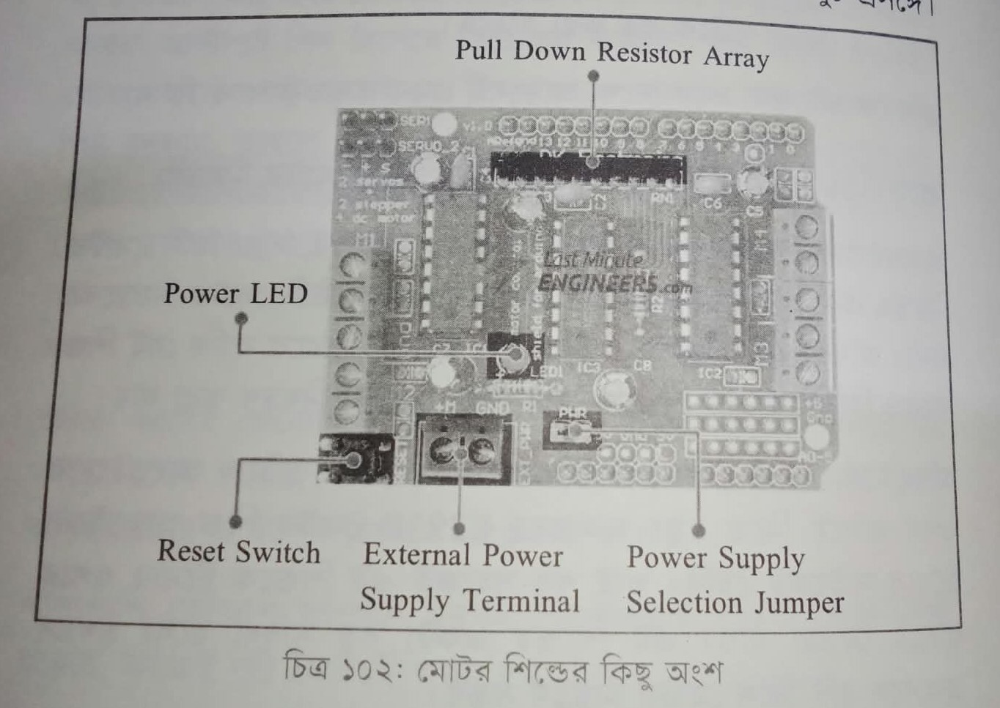
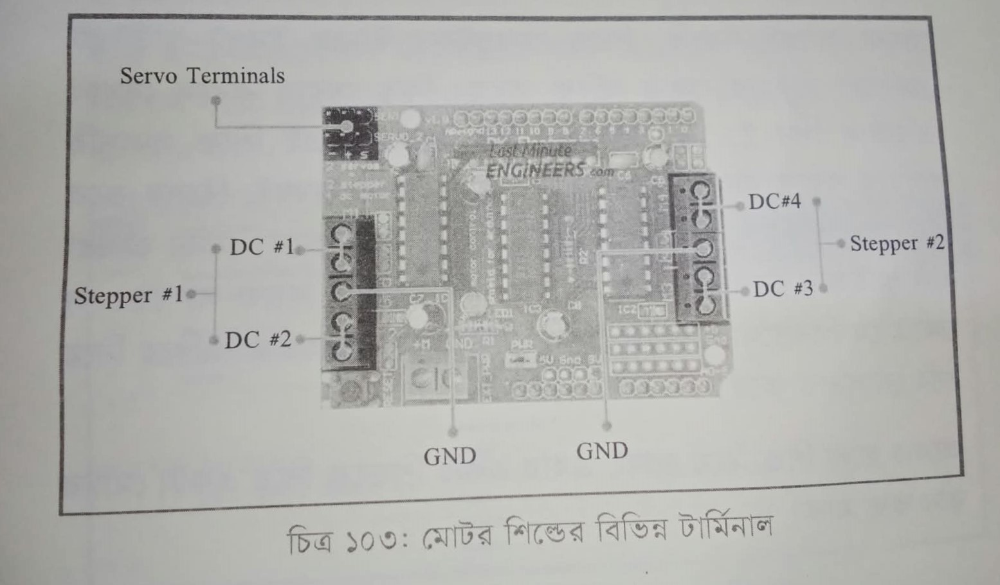

# প্রজেক্ট ৭ — Motor Shield

মূল বইয়ের প্রজেক্ট ১৮। L298N-এ অনেক জাম্পার। শিল্ড Arduino-র উপরে বসে, তাই IN পিন আলাদা করে টানতে হয় না। মোটর স্ক্রু টার্মিনালে যায়, পাওয়ার আলাদা ব্যাটারি থেকে।

শিল্ডের নিচের দিকে পাওয়ার LED, রিসেট সুইচ, এক্সটার্নাল পাওয়ার টার্মিনাল, আর পাওয়ার সিলেকশন জাম্পার। ওপরে পুল-ডাউন রেজিস্টর অ্যারে।



টার্মিনালগুলো আলাদা করে দেখলে বাঁয়ে DC 1 আর DC 2, সেখানেই Stepper 1। ডানে DC 3 আর DC 4, সেখানে Stepper 2। ওপরে সারভো টার্মিনাল। নিচে দুই GND। এই প্রজেক্টে দুই ডিসি মোটর, সারভো বা স্টেপার লাগছে না।



ডায়াগ্রামের বোর্ড Adafruit Motor Shield v2.3। লেখা আছে ২ স্টেপার অথবা ৪ ডিসি মোটর, প্রতি মোটরে ১.২ অ্যাম্পিয়ার, মোট ৩ অ্যাম্পিয়ার। মোটর পাওয়ার ৫ থেকে ১২ ভোল্ট।

শিল্ড Uno-র উপরে বসাও, পিন যেন বেঁকে না যায়। বাঁয়ের মোটর M2-এ, ডানের মোটর M1-এ। নিচের টার্মিনালে ব্যাটারি, লাল প্লাস, কালো মাইনাস। ব্যাটারির লেবেল E585460-4121, E4104-L58-1, ২০০০ mAh, ৩.৭ ভোল্ট।


৩.৭ ভোল্ট এক সেলে অনেক গিয়ার মোটর ধীরে ঘোরে, বা ঘোরেই না। না ঘুরলে ৬ ভোল্ট দাও। ১২ ভোল্টের বেশি দিও না। USB দিলে লজিক চলে, মোটরের পাওয়ার ওই নিচের টার্মিনাল থেকে আসে।

লাইব্রেরি Library Manager থেকে Adafruit Motor Shield V2। ডায়াগ্রাম v2.3, তাই v2 লাইব্রেরি। পুরনো v1 শিল্ড হলে কোড আলাদা।

`codes/project7_motor_shield.ino`

```cpp
#include <Adafruit_MotorShield.h>

Adafruit_MotorShield AFMS = Adafruit_MotorShield();
Adafruit_DCMotor *motor1 = AFMS.getMotor(1);
Adafruit_DCMotor *motor2 = AFMS.getMotor(2);

void setup() {
  AFMS.begin();
  motor1->setSpeed(200);
  motor2->setSpeed(200);
}

void loop() {
  motor1->run(FORWARD);
  motor2->run(FORWARD);
  delay(2000);
  motor1->run(BACKWARD);
  motor2->run(BACKWARD);
  delay(2000);
  motor1->run(RELEASE);
  motor2->run(RELEASE);
  delay(1000);
}
```

`getMotor(1)` মানে M1, `getMotor(2)` মানে M2। `begin` না দিলে শিল্ড জাগে না। স্পিড ০ থেকে ২৫৫। FORWARD সামনে, BACKWARD পেছনে, RELEASE ছেড়ে দেয়। দুই সেকেন্ড সামনে, দুই সেকেন্ড পেছনে, এক সেকেন্ড থেমে। এক মোটর উল্টো ঘুরলে টার্মিনালের তার পাল্টে দাও। স্ক্রু ঢিলা থাকলে মোটর নড়ে না।
